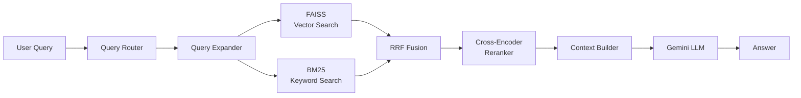
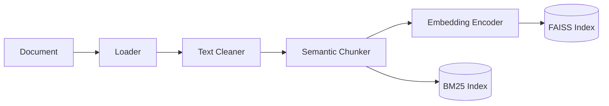

<div align="center">

# Hybrid RAG Engine

**A production-ready Retrieval-Augmented Generation engine for intelligent document understanding and question answering over your private data.**

[](https://www.python.org/)
[](https://fastapi.tiangolo.com/)
[](https://www.docker.com/)
[](LICENSE)

[Overview](#overview) | [Features](#key-features) | [Architecture](#architecture) | [Quick Start](#quick-start) | [API](#api-reference) | [Configuration](#configuration) | [Troubleshooting](#troubleshooting)

</div>

---

## Overview

**Hybrid RAG Engine** is a complete, end-to-end Retrieval-Augmented Generation system that lets Large Language Models answer questions grounded in **your own documents** — PDFs, Word files, PowerPoint presentations, images, and web pages.

Unlike generic chatbots, this engine:

- **Retrieves** the most relevant chunks from your private corpus using a **hybrid strategy** (dense vector search + sparse keyword search).
- **Reranks** them with a cross-encoder model for maximal precision.
- **Generates** answers using Google Gemini, strictly grounded in the retrieved context — with automatic fallback to general knowledge when the answer isn't in your documents.

The result: **accurate, cited, context-aware answers** you can actually trust.

---

## Key Features

<table>
<tr>
<td width="50%" valign="top">

### End-to-End Pipeline
- Multi-format ingestion
- Semantic chunking
- Embedding generation
- Hybrid retrieval
- Cross-encoder reranking
- Controlled generation

### Multi-Format Support
- **PDF** — via PyMuPDF
- **DOCX** — via python-docx
- **PPTX** — via python-pptx
- **Images** — OCR via Tesseract
- **Web URLs** — via trafilatura
- **Raw text** — direct input

</td>
<td width="50%" valign="top">

### Advanced Retrieval
- **Hybrid search**: FAISS (dense) + BM25 (sparse)
- **Multi-query expansion** for better recall
- **RRF fusion** of multiple result sets
- **Query routing** by intent (factual / summary / reasoning / table)
- **Cross-encoder reranking** for precision

### Production Ready
- FastAPI REST API with OpenAPI docs
- Docker-ready (CPU-optimized)
- Persistent FAISS & BM25 indices
- Response caching (diskcache)
- Structured logging (loguru)
- Conversation history support

</td>
</tr>
</table>

---

## Architecture

### Pipeline Overview



### Ingestion Pipeline



### Module Layout

```
app/
├── api/          -> FastAPI routes & Pydantic schemas
├── config/       -> Environment-driven settings
├── core/
│   ├── ingest/   -> PDF, DOCX, PPTX, image, URL parsers
│   ├── chunk/    -> Semantic chunker + chunk models
│   ├── embed/    -> Sentence-transformers encoder
│   ├── store/    -> FAISS vector store + BM25 index
│   ├── retrieve/ -> Router, expander, hybrid search, RRF
│   ├── rerank/   -> Cross-encoder reranker
│   ├── generate/ -> Context builder + Gemini client
│   └── pipeline.py  -> Top-level orchestrator
└── utils/        -> Logging + caching
```

See [`docs/ARCHITECTURE.md`](docs/ARCHITECTURE.md) for a deep dive.

---

## Quick Start

### Option A — Docker (recommended)

**Prerequisites:** Docker Desktop or Docker Engine with Compose v2.

```bash
# 1. Clone
git clone https://github.com/M0hamed0mar/hybrid-rag-engine.git
cd hybrid-rag-engine

# 2. Configure environment
cp .env.example .env
# Then edit .env and set GOOGLE_API_KEY=...

# 3. Build and run
docker compose up -d --build

# 4. Open
#    Web UI   -> http://localhost:8000
#    API docs -> http://localhost:8000/docs
```

To stop:

```bash
docker compose down
```

### Option B — Local Python

**Prerequisites:**
- Python 3.11+
- [Tesseract OCR](https://github.com/tesseract-ocr/tesseract) installed system-wide (for image ingestion)
- ~5 GB disk for ML models (downloaded on first run)

```bash
# 1. Create and activate a virtual environment
python -m venv .venv
source .venv/bin/activate        # Linux/macOS
# .venv\Scripts\activate         # Windows

# 2. Install dependencies
pip install -r requirements.txt

# 3. Configure environment
cp .env.example .env
# Edit .env, set GOOGLE_API_KEY=...

# 4. Run
python run.py
```

Then open **http://localhost:8000**.

---

## API Reference

Base URL: `http://localhost:8000/api/v1`

| Method | Endpoint | Description |
|--------|----------|-------------|
| `GET`  | `/health` | System health & stats |
| `POST` | `/ingest/file` | Upload and ingest a file (multipart) |
| `POST` | `/ingest/url` | Ingest a web URL |
| `POST` | `/ingest/text` | Ingest raw text |
| `POST` | `/query` | Ask a question |
| `GET`  | `/stats` | System statistics |
| `GET`  | `/documents` | List ingested documents |
| `DELETE` | `/documents/{source}` | Delete a document |
| `DELETE` | `/clear-all` | Wipe all data |
| `DELETE` | `/cache` | Clear response cache |
| `GET`  | `/conversation/history` | Get chat history |
| `DELETE` | `/conversation/history` | Clear chat history |

### Example: Ask a question

```bash
curl -X POST http://localhost:8000/api/v1/query \
  -H "Content-Type: application/json" \
  -d '{"query": "What are the key insights from the document?", "top_k": 5}'
```

**Response:**

```json
{
  "query": "What are the key insights from the document?",
  "answer": "...",
  "source_note": "From: report.pdf",
  "query_type": "factual",
  "total_chunks_retrieved": 5,
  "processing_time_ms": 842.5
}
```

### Example: Ingest a file

```bash
curl -X POST http://localhost:8000/api/v1/ingest/file \
  -F "file=@./report.pdf"
```

Full API docs at [`docs/API.md`](docs/API.md) or interactive at `/docs` (Swagger UI).

---

## Configuration

All configuration is environment-driven. Copy `.env.example` to `.env` and adjust.

| Variable | Default | Description |
|----------|---------|-------------|
| `GOOGLE_API_KEY` | *(required)* | Google Gemini API key |
| `HOST` | `0.0.0.0` | Bind host |
| `PORT` | `8000` | Bind port |
| `DEBUG` | `false` | Enable debug + auto-reload |
| `TESSERACT_CMD` | `tesseract` | Path to Tesseract binary |
| `CHUNK_SIZE` | `512` | Characters per chunk |
| `CHUNK_OVERLAP` | `100` | Overlap between chunks |
| `TOP_K_RETRIEVAL` | `10` | Chunks retrieved before reranking |
| `TOP_K_RERANK` | `5` | Chunks kept after reranking |
| `MAX_CONTEXT_TOKENS` | `4000` | Max tokens sent to the LLM |

### Models used

| Purpose | Model | Size |
|---------|-------|------|
| Embeddings | `sentence-transformers/paraphrase-multilingual-MiniLM-L12-v2` | ~120 MB |
| Reranker | `cross-encoder/ms-marco-MiniLM-L-6-v2` | ~90 MB |
| LLM | `models/gemini-2.5-flash` | API |

Models are downloaded on first run and cached (Docker uses a named volume `hf-cache`).

---

## Docker Details

The provided `Dockerfile` is **CPU-optimized**:

- **Multi-stage build** — build tools are discarded from the final image.
- **`python:3.11-slim-bookworm`** base (glibc, required by FAISS / PyMuPDF).
- **Non-root user** (`appuser`, UID 1000).
- **System deps**: `tesseract-ocr`, `libgl1`, `libglib2.0-0`, `libgomp1`.
- **Health check** on `/health`.
- **HuggingFace cache** persisted via named volume so models download **once**.

### Useful Docker commands

```bash
# Build image manually
docker build -t hybrid-rag-engine:latest .

# Run container directly
docker run --rm -it -p 8000:8000 \
  -e GOOGLE_API_KEY=your_key \
  -v $(pwd)/data:/app/data \
  -v hf-cache:/home/appuser/.cache/huggingface \
  hybrid-rag-engine:latest

# View logs
docker compose logs -f

# Restart
docker compose restart
```

### Using the Makefile

```bash
make help           # list all targets
make docker-build   # build image
make up             # docker compose up -d --build
make down           # docker compose down
make logs           # tail logs
make clean          # remove local caches
```

---

## Project Structure

```
hybrid-rag-engine/
├── .github/workflows/        # CI (lint)
├── app/                      # Application source
├── data/                     # Runtime data (gitignored, persisted)
│   ├── uploads/              # Temp uploaded files
│   ├── index/                # FAISS + BM25 indices
│   ├── cache/                # Response cache
│   └── logs/                 # Application logs
├── docs/                     # Extended documentation
├── scripts/                  # Utility scripts
├── web/                      # Frontend (HTML/JS/CSS)
├── .dockerignore
├── .env.example
├── .gitignore
├── CHANGELOG.md
├── CONTRIBUTING.md
├── Dockerfile
├── docker-compose.yml
├── LICENSE
├── Makefile
├── README.md
├── requirements.txt
├── run.py                    # Local dev server
└── test_gemini.py            # -> scripts/
```

---

## Testing the Gemini API Key

Before running the full system, you can verify your API key works:

```bash
python scripts/test_gemini.py
```

This lists available models and runs a simple query.

---

## Use Cases

- **Enterprise knowledge management** — search across internal wikis, HR docs, policies
- **Document-based Q&A** — legal contracts, compliance manuals, technical specs
- **Research assistance** — papers, reports, literature reviews
- **Customer support** — grounded answers from product documentation
- **Education** — study notes, textbooks, lecture slides

---

## Troubleshooting

<details>
<summary><b>GOOGLE_API_KEY not set</b></summary>

Copy `.env.example` to `.env` and set `GOOGLE_API_KEY`. Get a key at
[Google AI Studio](https://aistudio.google.com/app/apikey).
</details>

<details>
<summary><b>tesseract: command not found</b></summary>

**Linux:** `sudo apt install tesseract-ocr tesseract-ocr-eng`  
**macOS:** `brew install tesseract`  
**Windows:** [Download installer](https://github.com/UB-Mannheim/tesseract/wiki) and set `TESSERACT_CMD` in `.env`.
</details>

<details>
<summary><b>Docker build fails with faiss/torch errors</b></summary>

The Dockerfile uses `python:3.11-slim-bookworm` (glibc). If you see build errors,
ensure you're using the provided Dockerfile unchanged. For ARM (M1/M2) hosts, add
`--platform linux/amd64` to the `docker build` command.
</details>

<details>
<summary><b>Out of memory during query</b></summary>

The full stack needs ~4 GB RAM. Reduce:
- `TOP_K_RETRIEVAL` (default 10 -> 5)
- `TOP_K_RERANK` (default 5 -> 3)
- `MAX_CONTEXT_TOKENS` (default 4000 -> 2000)
</details>

<details>
<summary><b>First query is very slow</b></summary>

On first run, HuggingFace downloads ~250 MB of models. Subsequent runs use the
cached volume and start in seconds.
</details>

---

## Contributing

Contributions are welcome! See [`CONTRIBUTING.md`](CONTRIBUTING.md) for guidelines.

---

## License

This project is licensed under the **MIT License** — see [`LICENSE`](LICENSE) for details.

---

## Acknowledgements

- [FastAPI](https://fastapi.tiangolo.com/) — web framework
- [Sentence-Transformers](https://www.sbert.net/) — embeddings
- [FAISS](https://github.com/facebookresearch/faiss) — vector search
- [rank-bm25](https://github.com/dorianbrown/rank_bm25) — keyword search
- [Google Gemini](https://ai.google.dev/) — LLM
- [Tesseract OCR](https://github.com/tesseract-ocr/tesseract) — image OCR

---

<div align="center">

**Built for anyone who wants reliable answers from their own documents.**

</div>